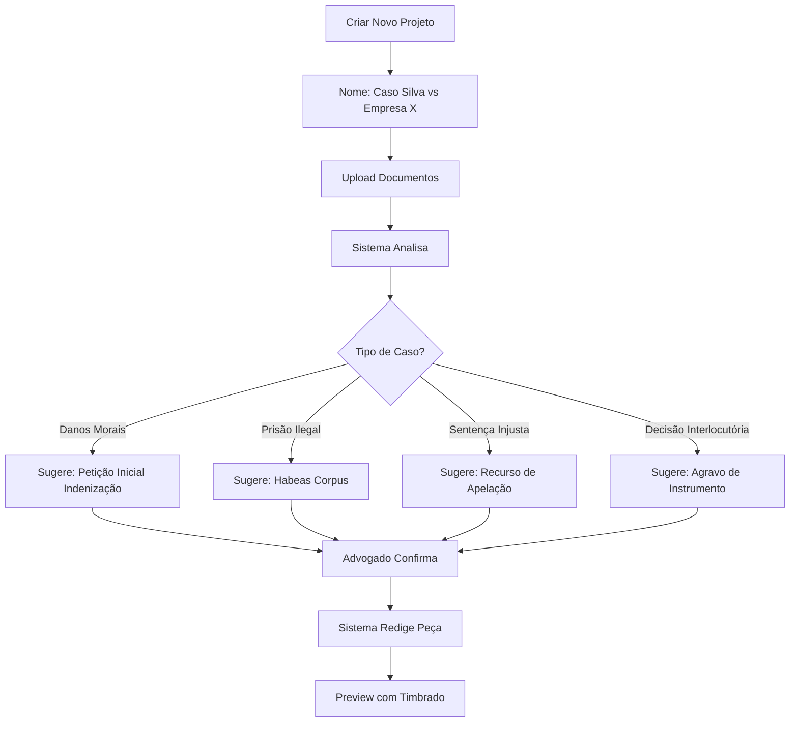

# 🎯 SISTEMA DE PROJETOS INTELIGENTE - ROM AGENT

**Versão**: 2.6.0
**Data**: 13 de dezembro de 2024

---

## 📋 CONCEITO

### Paradigma Anterior (v2.5.0)
```
Usuário → Escolhe tipo de peça → Sistema redige
```
❌ **Problema**: Usuário precisa saber qual peça criar

### Novo Paradigma (v2.6.0)
```
Usuário → Cria Projeto → Upload documentos → Sistema analisa
→ Sistema sugere instrumento → Advogado confirma → Sistema redige
```
✅ **Vantagem**: Sistema inteligente sugere automaticamente

---

## 🗂️ ESTRUTURA DE PROJETOS

### Sidebar Esquerda

```
┌─────────────────────────────────┐
│ ROM Agent                       │
├─────────────────────────────────┤
│ [+] Novo Projeto                │ ← Botão destaque dourado
├─────────────────────────────────┤
│ 📁 PROJETOS (5)                 │
│                                 │
│ ┌─────────────────────────────┐ │
│ │ ● Caso Silva vs Empresa X  │ │ ← Projeto ativo
│ │   📄 12 documentos          │ │
│ │   ⚖️ Petição Inicial        │ │ ← Tipo sugerido
│ │   🕐 Hoje, 14:30            │ │
│ └─────────────────────────────┘ │
│                                 │
│ ┌─────────────────────────────┐ │
│ │   Indenização Danos Morais │ │
│ │   📄 8 documentos           │ │
│ │   📋 Recurso Apelação       │ │
│ │   🕐 Ontem, 16:45           │ │
│ └─────────────────────────────┘ │
│                                 │
│ ┌─────────────────────────────┐ │
│ │   HC João da Silva         │ │
│ │   📄 5 documentos           │ │
│ │   ⚖️ Habeas Corpus          │ │
│ │   🕐 3 dias atrás           │ │
│ └─────────────────────────────┘ │
│                                 │
│ [Mostrar mais...]               │
├─────────────────────────────────┤
│ 📊 Dashboard                    │
│ 🔧 Ferramentas                  │
│ ⚙️ Configurações                │
│ 🌙 Modo Escuro                  │
└─────────────────────────────────┘
```

### Card de Projeto

Cada projeto mostra:
- **Nome** do projeto/caso
- **Número de documentos** no KB
- **Tipo sugerido** de peça (ícone + nome)
- **Data/hora** última modificação
- **Status**: ativo (●), em andamento, concluído

---

## 🧠 INTELIGÊNCIA DE ANÁLISE

### Fluxo Automático



### Análise Inteligente

**O sistema analisa**:
1. **Documentos enviados**:
   - Contratos
   - Prints de conversas
   - Laudos médicos
   - Processos existentes
   - Sentenças
   - Decisões

2. **Identifica**:
   - Tipo de direito (cível, criminal, trabalhista)
   - Fase processual (inicial, recursal, execução)
   - Urgência (tutela, HC, liminar)
   - Partes envolvidas
   - Pedidos implícitos

3. **Sugere**:
   - Instrumento jurídico adequado
   - Fundamentos legais aplicáveis
   - Jurisprudência relevante
   - Prazos a observar

### Exemplo de Análise

```json
{
  "projeto": "Caso Silva vs Empresa X",
  "analise": {
    "tipo_direito": "trabalhista",
    "fase": "inicial",
    "documentos_analisados": [
      "Contrato_Trabalho.pdf",
      "Recibos_Salario.pdf",
      "Print_Demissao_Irregular.pdf"
    ],
    "situacao_identificada": "Demissão sem justa causa com pagamento irregular de verbas rescisórias",
    "instrumento_sugerido": {
      "tipo": "reclamacao_trabalhista",
      "nome": "Reclamação Trabalhista",
      "confianca": 0.95,
      "motivo": "Documentos indicam relação de trabalho com rescisão irregular"
    },
    "pedidos_identificados": [
      "Aviso prévio indenizado",
      "13º salário proporcional",
      "Férias + 1/3",
      "FGTS + 40%",
      "Multa Art. 477 CLT"
    ],
    "fundamentos_sugeridos": [
      "Art. 477 CLT",
      "Art. 467 CLT",
      "Súmula 326 TST"
    ]
  }
}
```

---

## 📚 KB POR PROJETO

### Estrutura

```
KB/
├── projetos/
│   ├── projeto_001_caso_silva/
│   │   ├── documentos/
│   │   │   ├── contrato.pdf
│   │   │   ├── recibos.pdf
│   │   │   └── prints.pdf
│   │   ├── extraidos/
│   │   │   ├── contrato_extraido.json
│   │   │   ├── recibos_extraido.json
│   │   │   └── prints_extraido.json
│   │   ├── analise.json
│   │   └── metadata.json
│   │
│   ├── projeto_002_indenizacao/
│   │   └── ...
│   │
│   └── projeto_003_hc_joao/
│       └── ...
```

### Metadata do Projeto

```json
{
  "id": "projeto_001",
  "nome": "Caso Silva vs Empresa X",
  "data_criacao": "2024-12-13T15:00:00Z",
  "ultima_modificacao": "2024-12-13T16:30:00Z",
  "status": "ativo",
  "tipo_sugerido": "reclamacao_trabalhista",
  "documentos": 12,
  "partes": {
    "autor": "João Silva",
    "reu": "Empresa X LTDA"
  },
  "tags": ["trabalhista", "rescisão", "verbas"],
  "prioridade": "alta",
  "prazo": "2024-12-20"
}
```

---

## 🔧 33 FERRAMENTAS DE EXTRAÇÃO

### Integração

Quando o usuário faz upload de documento:

1. **Sistema detecta tipo** (PDF, DOCX, imagem)
2. **Aplica ferramenta adequada**:
   - Extrator de contratos
   - Extrator de processos
   - OCR para imagens
   - Analisador de sentença
   - etc.
3. **Salva resultado** em `/extraidos/`
4. **Alimenta análise inteligente**

### Ferramentas Disponíveis (33)

```javascript
const ferramentas = [
  // Documentos
  { id: 1, nome: "Extrator de Contratos", tipo: "contrato" },
  { id: 2, nome: "Extrator de Processos", tipo: "processo" },
  { id: 3, nome: "Analisador de Sentença", tipo: "sentenca" },
  { id: 4, nome: "Extrator de Decisão", tipo: "decisao" },
  { id: 5, nome: "Analisador de Acórdão", tipo: "acordao" },

  // OCR
  { id: 6, nome: "OCR Documentos", tipo: "ocr" },
  { id: 7, nome: "OCR Manuscritos", tipo: "ocr_handwriting" },

  // Análise
  { id: 8, nome: "Identificador de Partes", tipo: "partes" },
  { id: 9, nome: "Extrator de Datas", tipo: "datas" },
  { id: 10, nome: "Identificador de Pedidos", tipo: "pedidos" },
  { id: 11, nome: "Extrator de Valores", tipo: "valores" },

  // Jurisprudência
  { id: 12, nome: "Analisador de Jurisprudência", tipo: "jurisprudencia" },
  { id: 13, nome: "Identificador de Súmulas", tipo: "sumulas" },

  // Legislação
  { id: 14, nome: "Identificador de Artigos", tipo: "artigos" },
  { id: 15, nome: "Analisador de Lei", tipo: "lei" },

  // ... (continua até 33)
];
```

---

## 🎨 INTERFACE - NOVO PROJETO

### Modal "Criar Novo Projeto"

```
┌─────────────────────────────────────────┐
│  Criar Novo Projeto                 [×] │
├─────────────────────────────────────────┤
│                                         │
│  Nome do Projeto *                      │
│  ┌─────────────────────────────────┐   │
│  │ Ex: Caso Silva vs Empresa X    │   │
│  └─────────────────────────────────┘   │
│                                         │
│  Descrição (opcional)                   │
│  ┌─────────────────────────────────┐   │
│  │ Ação trabalhista rescisão...   │   │
│  └─────────────────────────────────┘   │
│                                         │
│  Upload de Documentos                   │
│  ┌─────────────────────────────────┐   │
│  │   Arraste arquivos aqui ou      │   │
│  │   [Clique para selecionar]      │   │
│  │                                 │   │
│  │   PDF, DOCX, TXT, Imagens       │   │
│  └─────────────────────────────────┘   │
│                                         │
│  ☐ Analisar automaticamente             │
│  ☐ Sugerir instrumento jurídico         │
│                                         │
│  [Cancelar]  [Criar Projeto] ←dourado  │
└─────────────────────────────────────────┘
```

### Tela do Projeto

```
┌──────────────┬────────────────────┬───────────┐
│  Sidebar     │  Área Principal    │  Preview  │
├──────────────┼────────────────────┼───────────┤
│              │                    │           │
│ [Projeto]    │ 📁 Caso Silva vs X │           │
│              │                    │           │
│ Caso Silva ● │ 📊 ANÁLISE         │           │
│              │ ┌────────────────┐ │           │
│ Documentos:  │ │ ✅ 12 docs     │ │           │
│ ├ contrato   │ │ ⚖️ Sugestão:   │ │           │
│ ├ recibos    │ │ Petição Inicial│ │           │
│ └ prints     │ │ Indenização    │ │           │
│              │ │                │ │           │
│ Status:      │ │ [Confirmar]    │ │           │
│ ● Ativo      │ │ [Modificar]    │ │           │
│              │ └────────────────┘ │           │
│ Tipo:        │                    │           │
│ Trabalhista  │ 📝 DOCUMENTOS (12) │           │
│              │ • contrato.pdf     │           │
│ Prazo:       │ • recibos.pdf      │           │
│ 20/12/2024   │ • prints.pdf       │           │
│              │ [+ Upload]         │           │
│              │                    │           │
│              │ 💬 CHAT            │           │
│              │ [Digite aqui...]   │           │
│              │                    │           │
└──────────────┴────────────────────┴───────────┘
```

---

## 🔄 FLUXO COMPLETO

### 1. Criar Projeto

```javascript
// Usuário clica em "+ Novo Projeto"
createProject({
  nome: "Caso Silva vs Empresa X",
  descricao: "Ação trabalhista rescisão irregular"
});

// Sistema cria estrutura
mkdir KB/projetos/projeto_001_caso_silva/
mkdir KB/projetos/projeto_001_caso_silva/documentos/
mkdir KB/projetos/projeto_001_caso_silva/extraidos/
```

### 2. Upload Documentos

```javascript
// Usuário faz upload
uploadDocuments([
  "contrato.pdf",
  "recibos.pdf",
  "prints.pdf"
]);

// Sistema aplica ferramentas de extração
for (doc of documents) {
  const ferramenta = detectTool(doc);
  const extraido = ferramenta.extract(doc);
  save(`extraidos/${doc.name}_extraido.json`, extraido);
}
```

### 3. Análise Inteligente

```javascript
// Sistema analisa documentos extraídos
const analise = await analisarProjeto({
  documentos: extraidos,
  contexto: projeto.descricao
});

// Sugere instrumento
const sugestao = {
  tipo: "peticao_inicial_trabalhista",
  confianca: 0.95,
  motivo: "Rescisão irregular identificada",
  pedidos: [...],
  fundamentos: [...]
};

// Mostra para advogado
showSuggestion(sugestao);
```

### 4. Advogado Confirma

```javascript
// Advogado clica em "Confirmar"
confirmarSugestao(sugestao);

// Sistema carrega prompt específico
const prompt = loadPrompt(sugestao.tipo);

// Sistema redige peça
const peca = await redigirPeca({
  prompt: prompt,
  contexto: analise,
  documentos: extraidos
});

// Mostra preview
showPreview(peca);
```

---

## 📱 RESPONSIVO

### Desktop
- Sidebar com lista completa de projetos
- Área principal com análise e documentos
- Preview com timbrado

### Mobile
- Drawer com projetos
- Tabs: Documentos / Chat / Preview
- Upload simplificado

---

## 🔐 SEGURANÇA

### Isolamento por Projeto
- Cada projeto tem seu próprio KB
- Documentos não vazam entre projetos
- Análise independente

### Backup
- Backup automático por projeto
- Export de projeto completo
- Import de projeto

---

## 📊 MÉTRICAS

### Dashboard
- Total de projetos: 25
- Projetos ativos: 5
- Documentos processados: 320
- Taxa de acerto da IA: 94%

---

## 🚀 IMPLEMENTAÇÃO

### APIs Necessárias

```javascript
POST /api/projects/create        // Criar projeto
GET  /api/projects/list          // Listar projetos
GET  /api/projects/:id           // Detalhes projeto
POST /api/projects/:id/upload    // Upload documentos
POST /api/projects/:id/analyze   // Analisar projeto
POST /api/projects/:id/confirm   // Confirmar sugestão
POST /api/projects/:id/draft     // Redigir peça
DELETE /api/projects/:id         // Excluir projeto
```

---

**🎯 SISTEMA DE PROJETOS TORNA O ROM AGENT VERDADEIRAMENTE INTELIGENTE!**
