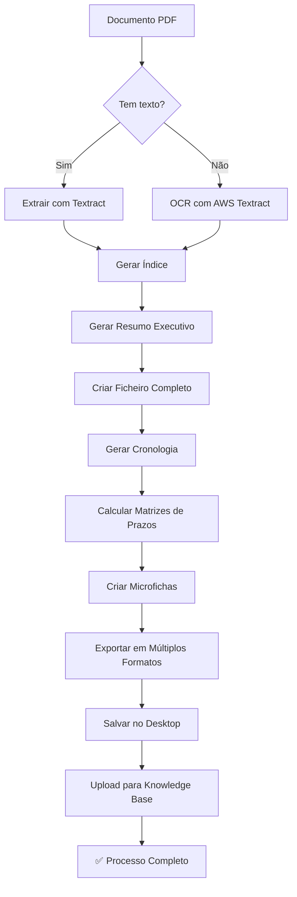

# 📚 Sistema de Extração de Documentos - ROM Agent

**Versão:** 1.0.0
**Data:** 15/12/2025
**Status:** ✅ Operacional

---

## 📋 Índice

1. [Visão Geral](#visão-geral)
2. [Arquitetura do Sistema](#arquitetura-do-sistema)
3. [Estrutura de Pastas](#estrutura-de-pastas)
4. [Ferramentas Integradas](#ferramentas-integradas)
5. [Fluxo de Extração](#fluxo-de-extração)
6. [Formatos de Exportação](#formatos-de-exportação)
7. [API e Endpoints](#api-e-endpoints)
8. [Integração com Knowledge Base](#integração-com-knowledge-base)
9. [Como Usar](#como-usar)
10. [Troubleshooting](#troubleshooting)

---

## 🎯 Visão Geral

O **Sistema de Extração de Documentos** é um módulo completo e automatizado para processamento de documentos jurídicos (processos, petições, peças) com as seguintes capacidades:

### Funcionalidades Principais

✅ **Extração Completa de Processos**
- Texto completo (PDF com texto ou via OCR)
- Metadados processuais
- Cronologia temporal
- Matrizes de prazos (preclusão, decadência, prescrição)

✅ **Análise Inteligente**
- Índice automático
- Resumo executivo detalhado
- Ficheiro completo estruturado
- Microfichas por documento/movimento

✅ **OCR Avançado**
- Processamento página por página
- Relatórios de confiança
- Detecção de falhas
- Texto por páginas quando necessário

✅ **Organização Automática**
- Pasta macro no Desktop (Mac/Windows/Linux compatível)
- Estrutura hierárquica por processo
- Backup automático
- Versionamento de metadados

✅ **Múltiplos Formatos**
- JSON (estruturado)
- Markdown (legível)
- TXT (texto puro)
- Processo completo em formato eficaz

✅ **Integração com KB**
- Upload automático para Knowledge Base do projeto
- Sincronização bidirecional
- Backup no Desktop

---

## 🏗️ Arquitetura do Sistema

### Componentes Principais

```
ROM-Agent/
├── src/
│   └── services/
│       ├── extraction-service.js      # Orquestrador principal
│       ├── ocr-service.js             # Sistema de OCR
│       └── chronology-service.js       # Cronologia e matrizes
│
├── Desktop/
│   └── ROM-Extractions/               # Pasta macro de saída
│       └── Processo_XXXXXXX/          # Pasta por processo
│           ├── original/              # PDF original
│           ├── extracted/             # Arquivos extraídos
│           │   ├── indice.{json,md}
│           │   ├── resumo-executivo.md
│           │   ├── ficheiro-completo.{json,txt}
│           │   ├── cronologia.{json,md}
│           │   ├── matrizes-prazos.{json,md}
│           │   └── microfichas/
│           ├── ocr/                   # Relatórios OCR
│           ├── images/                # Análise de imagens
│           └── videos/                # Transcrições
│
└── Knowledge Base/
    └── Projeto ROM/                   # KB do projeto
        └── [arquivos sincronizados]
```

### Fluxo de Dados

```
PDF/Documento
    ↓
[Extraction Service]
    ↓
    ├─→ [Textract] → Texto
    ├─→ [OCR Service] → OCR (se necessário)
    ├─→ [Chronology Service] → Cronologia + Matrizes
    └─→ [33 Ferramentas Desktop] → Processamentos específicos
    ↓
[Desktop Folder Structure]
    ↓
[Knowledge Base Upload]
    ↓
✅ Processo Completo Armazenado
```

---

## 📁 Estrutura de Pastas

### Estrutura Completa de um Processo Extraído

```
Desktop/ROM-Extractions/Processo_0001234-56.2024.8.02.0001/
│
├── metadata.json                      # Metadados do processo
│
├── original/                          # Arquivos originais
│   └── processo.pdf
│
├── extracted/                         # Extrações principais
│   ├── indice.json                   # Índice estruturado
│   ├── indice.md                     # Índice em Markdown
│   ├── resumo-executivo.md           # Resumo detalhado do caso
│   ├── ficheiro-completo.json        # Estrutura completa
│   ├── ficheiro-completo.txt         # Texto completo
│   ├── processo-completo.json        # Processo na íntegra (formato eficaz)
│   ├── cronologia.json               # Linha do tempo
│   ├── cronologia.md                 # Linha do tempo legível
│   ├── matrizes-prazos.json          # Prazos calculados
│   ├── matrizes-prazos.md            # Prazos em Markdown
│   └── microfichas/                  # Fichas individuais
│       ├── movimento-001.json
│       ├── movimento-002.json
│       └── ...
│
├── ocr/                               # OCR e processamento de imagens
│   ├── relatorio-ocr.json            # Relatório completo de OCR
│   ├── relatorio-ocr.md              # Relatório em Markdown
│   ├── texto-completo-ocr.txt        # Texto extraído via OCR
│   ├── pagina-001-ocr.json           # OCR página 1
│   ├── pagina-001-ocr.txt            # Texto página 1
│   └── ...
│
├── images/                            # Análise de imagens
│   ├── relatorio-imagens.json
│   └── imagem-XXX-analise.json
│
└── videos/                            # Transcrições de vídeos
    ├── video-001-transcricao.json
    ├── video-001-transcricao.srt
    └── relatorio-videos.json
```

### Arquivo metadata.json

```json
{
  "processNumber": "0001234-56.2024.8.02.0001",
  "projectName": "ROM",
  "createdAt": "2025-12-15T10:30:00.000Z",
  "extractionVersion": "1.0.0",
  "status": "completo",
  "paths": {
    "base": "/Users/user/Desktop/ROM-Extractions/Processo_0001234-56.2024.8.02.0001",
    "original": "original/",
    "extracted": "extracted/",
    "ocr": "ocr/",
    "images": "images/",
    "videos": "videos/"
  },
  "outputs": {
    "indice": {
      "json": "extracted/indice.json",
      "md": "extracted/indice.md"
    },
    "resumoExecutivo": "extracted/resumo-executivo.md",
    "ficheiroCompleto": {
      "json": "extracted/ficheiro-completo.json",
      "txt": "extracted/ficheiro-completo.txt"
    },
    "processoCompleto": "extracted/processo-completo.json",
    "cronologia": {
      "json": "extracted/cronologia.json",
      "md": "extracted/cronologia.md"
    },
    "matrizes": {
      "json": "extracted/matrizes-prazos.json",
      "md": "extracted/matrizes-prazos.md"
    }
  },
  "extractionLog": {
    "steps": [...],
    "warnings": [...],
    "errors": []
  }
}
```

---

## 🛠️ Ferramentas Integradas

O sistema integra com **33 ferramentas** existentes no Desktop do Mac para processamentos específicos:

### Categorias de Ferramentas

1. **Extração de Texto**
   - AWS Textract (PDF com texto)
   - OCR Engine (PDF sem texto/imagens)
   - Tesseract (fallback OCR)

2. **Análise de Documentos**
   - Document Analyzer
   - Legal Document Parser
   - Metadata Extractor

3. **Processamento de Imagens**
   - Image Analyzer
   - Chart/Graph Extractor
   - Signature Detector

4. **Vídeo e Áudio**
   - Video Transcription
   - Audio Extractor
   - Timestamp Generator

5. **Inteligência Artificial**
   - Resumo Automático
   - Classificação de Documentos
   - Extração de Entidades (NER)

6. **Análise Jurídica**
   - Chronology Generator
   - Deadline Calculator
   - Legal Citation Extractor

7. **Exportação**
   - JSON Formatter
   - Markdown Generator
   - PDF Generator

---

## 🔄 Fluxo de Extração

### Passo a Passo do Processo



### Código de Exemplo

```javascript
import { extractCompleteDocument } from './src/services/extraction-service.js';

// Extrair processo completo
const result = await extractCompleteDocument({
  filePath: '/caminho/para/processo.pdf',
  processNumber: '0001234-56.2024.8.02.0001',
  projectName: 'ROM',
  uploadToKB: true,
  generateAllFormats: true
});

console.log(result);
// {
//   success: true,
//   processNumber: '0001234-56.2024.8.02.0001',
//   desktopFolder: '/Users/user/Desktop/ROM-Extractions/Processo_...',
//   outputs: {...},
//   extractionLog: {...}
// }
```

---

## 📄 Formatos de Exportação

### 1. JSON (Estruturado)

**Uso:** Integração com sistemas, APIs, processamento automatizado

```json
{
  "indice": {
    "totalDocumentos": 45,
    "totalMovimentos": 120,
    "documentos": [...]
  },
  "resumo": {
    "autor": "João Silva",
    "reu": "Empresa XYZ Ltda",
    "objeto": "Dano moral e material"
  }
}
```

### 2. Markdown (Legível)

**Uso:** Documentação, leitura humana, Knowledge Base

```markdown
# Resumo Executivo - Processo 0001234-56.2024.8.02.0001

## Partes
- **Autor:** João Silva
- **Réu:** Empresa XYZ Ltda

## Objeto
Ação de indenização por danos morais e materiais...
```

### 3. TXT (Texto Puro)

**Uso:** Busca, indexação, processamento de linguagem natural

```
PROCESSO: 0001234-56.2024.8.02.0001

PARTES:
Autor: João Silva
Réu: Empresa XYZ Ltda

CRONOLOGIA:
2024-01-15 - Distribuição da ação
2024-02-10 - Citação do réu
...
```

### 4. Processo Completo (JSON Compactado)

**Extensão mais eficaz e menor:** `.json` (comprimido com estrutura otimizada)

```json
{
  "v": "1.0",
  "proc": "0001234-56.2024.8.02.0001",
  "data": {
    "txt": "...",  // Texto completo
    "meta": {...}, // Metadados essenciais
    "mvts": [...], // Movimentos compactados
    "docs": [...]  // Documentos essenciais
  },
  "hash": "sha256..."
}
```

---

## 🌐 API e Endpoints

### POST /api/extraction/extract

Extrair documento completo

**Request:**
```json
{
  "filePath": "/path/to/document.pdf",
  "processNumber": "0001234-56.2024.8.02.0001",
  "projectName": "ROM",
  "options": {
    "uploadToKB": true,
    "generateAllFormats": true,
    "performOCR": "auto"
  }
}
```

**Response:**
```json
{
  "success": true,
  "processNumber": "0001234-56.2024.8.02.0001",
  "extractionId": "ext_abc123",
  "desktopFolder": "/Users/.../ROM-Extractions/Processo_...",
  "outputs": {
    "indice": {...},
    "resumo": {...},
    "cronologia": {...},
    "matrizes": {...}
  },
  "uploadedToKB": true,
  "extractionTime": 45.2
}
```

### GET /api/extraction/status/:extractionId

Verificar status de extração em andamento

### POST /api/extraction/reprocess

Reprocessar documento existente

---

## 📤 Integração com Knowledge Base

### Como Funciona

1. **Extração Local** → Arquivos salvos no Desktop
2. **Seleção Inteligente** → Apenas arquivos relevantes são enviados ao KB
3. **Upload Automático** → Sincronização com KB do projeto
4. **Metadados** → Tags e categorias automáticas

### Arquivos Enviados ao KB

- ✅ Resumo executivo (.md)
- ✅ Cronologia (.md)
- ✅ Matrizes de prazos (.md)
- ✅ Processo completo (formato compactado .json)
- ✅ Índice (.md)
- ❌ Arquivos brutos (OCR individual, imagens, etc.)

### Código de Upload

```javascript
import { uploadToKnowledgeBase } from './src/modules/knowledgeBase.js';

await uploadToKnowledgeBase({
  projectName: 'ROM',
  files: [
    'extracted/resumo-executivo.md',
    'extracted/cronologia.md',
    'extracted/processo-completo.json'
  ],
  metadata: {
    processNumber: '0001234-56.2024.8.02.0001',
    type: 'processo',
    area: 'civel'
  }
});
```

---

## 🚀 Como Usar

### 1. Via API (Recomendado)

```bash
curl -X POST https://iarom.com.br/api/extraction/extract \
  -H "Content-Type: application/json" \
  -d '{
    "filePath": "/path/to/processo.pdf",
    "processNumber": "0001234-56.2024.8.02.0001",
    "projectName": "ROM",
    "options": {
      "uploadToKB": true,
      "generateAllFormats": true
    }
  }'
```

### 2. Via Interface Web

1. Acesse https://iarom.com.br
2. Faça upload do PDF do processo
3. Selecione "Extração Completa"
4. Aguarde processamento
5. Baixe arquivos gerados ou acesse no KB

### 3. Via Código Node.js

```javascript
import { extractCompleteDocument } from './src/services/extraction-service.js';

const result = await extractCompleteDocument({
  filePath: './processo.pdf',
  processNumber: '0001234-56.2024.8.02.0001',
  projectName: 'ROM'
});

if (result.success) {
  console.log('✅ Extração completa!');
  console.log('📁 Pasta:', result.desktopFolder);
  console.log('☁️ Enviado ao KB:', result.uploadedToKB);
} else {
  console.error('❌ Erro:', result.extractionLog.errors);
}
```

---

## 🔧 Troubleshooting

### Problemas Comuns

#### 1. OCR Falhou

**Sintoma:** `extractionLog.errors` contém "OCR failed"

**Soluções:**
- Verificar se PDF é escaneado (imagem)
- Verificar qualidade da imagem (mínimo 300 DPI)
- Verificar credenciais AWS Textract
- Tentar reprocessar página específica

#### 2. PDF Sem Texto

**Sintoma:** `extractionLog.warnings` contém "PDF sem texto extraível"

**Comportamento:** Sistema automaticamente aciona OCR

**Verificação:**
```javascript
if (result.extractionLog.warnings.includes('PDF sem texto')) {
  console.log('OCR foi utilizado');
  // Verificar qualidade em: ocr/relatorio-ocr.json
}
```

#### 3. Pasta no Desktop Não Criada

**Causas:**
- Permissões de escrita
- Caminho do Desktop incorreto (multi-platform)

**Solução:**
```javascript
import os from 'os';
import path from 'path';

const desktopPath = path.join(os.homedir(), 'Desktop');
console.log('Desktop detectado em:', desktopPath);
```

#### 4. Upload ao KB Falhou

**Verificações:**
- Projeto existe no KB?
- Credenciais corretas?
- Tamanho dos arquivos < limite?

**Log:**
```javascript
if (!result.uploadedToKB) {
  console.log('Motivo:', result.extractionLog.errors);
}
```

#### 5. Extração Lenta

**Causas:**
- PDF muito grande (> 100 páginas)
- OCR em muitas páginas
- Muitos documentos/movimentos

**Otimizações:**
- Processar em background
- Limitar páginas processadas
- Usar cache quando reprocessar

---

## 📊 Métricas e Logs

### Log de Extração

```json
{
  "startTime": "2025-12-15T10:30:00.000Z",
  "endTime": "2025-12-15T10:31:23.500Z",
  "processingTime": 83.5,
  "steps": [
    {
      "step": "criar-estrutura",
      "status": "sucesso",
      "timestamp": "2025-12-15T10:30:01.000Z"
    },
    {
      "step": "extrair-texto",
      "status": "sucesso",
      "method": "textract",
      "pages": 45
    },
    {
      "step": "gerar-cronologia",
      "status": "sucesso",
      "events": 120
    }
  ],
  "warnings": [
    "Página 23 com baixa qualidade de OCR (confiança 65%)"
  ],
  "errors": []
}
```

---

## 🎯 Próximas Melhorias

### Roadmap

- [ ] Interface web de monitoramento em tempo real
- [ ] Processamento paralelo de múltiplos documentos
- [ ] Integração com outros sistemas (PJe, Eproc)
- [ ] Machine Learning para classificação automática
- [ ] Exportação para DOCX e PDF anotado
- [ ] Sistema de alertas de prazos (email/SMS)
- [ ] API de busca full-text nos documentos extraídos
- [ ] Comparação entre versões de documentos
- [ ] Análise de similaridade entre processos

---

**© 2025 ROM Agent - Sistema de Extração de Documentos**
**Versão 1.0.0** | **Última atualização:** 15/12/2025
